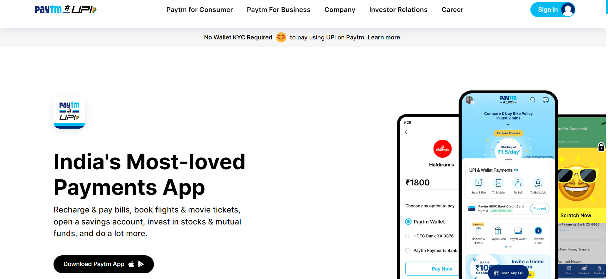

# Full Stack JS Assignment 15
# Paytm Clone

## Project 15 [Live Link](https://fs-js-project-15.netlify.app/)

-   What i learnt in this project
   - learnt tailwind css and its properties 
   - learned how to work with responsiveness in tailwind

---
#### Screenshot

